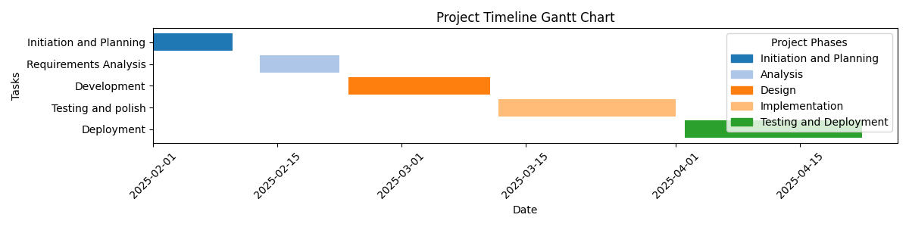
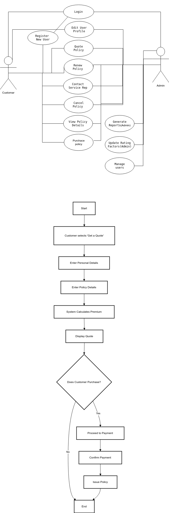
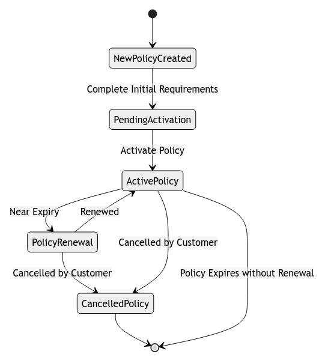

## Project Overview:

The Capstone 2025 project aims to develop a modern, efficient, and scalable insurance platform designed to enhance customer engagement, streamline policy management, and support future growth. This comprehensive system will facilitate various insurance-related functions for customers and administrators, including quoting, purchasing, renewing, and managing policies. The project emphasizes user-friendly design, robust functionality, security, and scalability.

## Built With
Angular
Java

## Collaborators
Joshua Crocker  
Gregory Dawe   
Dylan Mercer   
Nwokedi Nwatu  
Joel Oram 

# Capstone 2025 Project Proposal Documentation

This repository contains all the documentation and diagrams for the **Capstone 2025** project proposal.

## Table of Contents
- [Work plan](#Work-Plan)
- [System Requirements](#system-requirements)
- [Functional Model](#functional-model)
- [Structural Model](#structural-model)
- [Behavioral Model](#behavioral-model)

---

## System Requirements

For detailed information about the project's functional and non-functional requirements, please refer to the [SystemRequirements.md](./proposal_docs/SystemRequirements.md) document.

---

## Work Plan
Timeline for the project as Gantt Chart bellow

---

## Functional Model

The functional model includes the use case diagram and the core activity diagram (new quote).

- **Use Case Diagram**: [FunctionalModel.drawio](./proposal_docs/FunctionalModel.png)
- **Activity Diagram (New Quote)**: Included within the `FunctionalModel.drawio`
---

---

## Structural Model

The structural model is represented by the class diagram.

- **Class Diagram**: [StructuralModel.drawio](./proposal_docs/StructuralModel.png)

---

---

## Behavioral Model

The behavioral model includes the state diagram for the core object (policy).

- **State Diagram for Policy Object**: [BehavioralModel.drawio](./proposal_docs/BehavioralModel.drawio)
---

---

