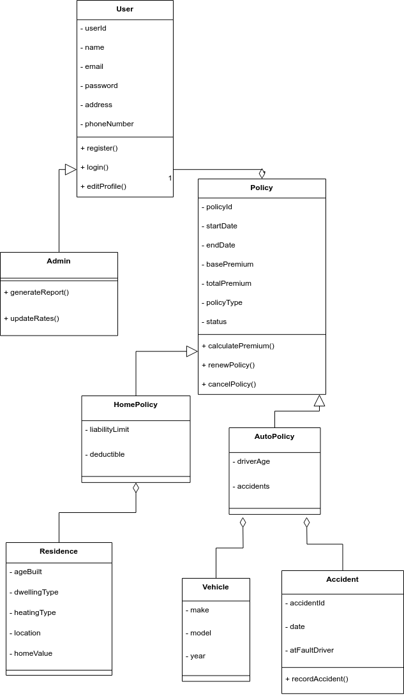

# Capstone_2025
Description of the Project

## Configure

## Built With

## Collaborators
Joshua Crocker  
Gregory Dawe   
Dylan Mercer   
Nwokedi Nwatu  
Joel Oram  
# Capstone 2025 Project Proposal Documentation

This repository contains all the documentation and diagrams for the **Capstone 2025** project proposal.
# Capstone 2025 Project Proposal Documentation

This repository contains all the documentation and diagrams for the **Capstone 2025** project proposal.

## Table of Contents

- [System Requirements](#system-requirements)
- [Workplan](#workplan)
- [Functional Model](#functional-model)
- [Structural Model](#structural-model)
- [Behavioral Model](#behavioral-model)
- [Diagrams](#diagrams)
- [Directory Structure](#directory-structure)
- [Getting Started](#getting-started)
- [Additional Information](#additional-information)
- [License](#license)

---

## System Requirements

For detailed information about the project's functional and non-functional requirements, please refer to the [SystemRequirements.md](./proposal_docs/SystemRequirements.md) document.

---

## Workplan

The project timeline and workplan are outlined in the [Workplan.drawio](./proposal_docs/Workplan.drawio) diagram.

> **Note:** The image above is generated from the `Workplan.drawio` file.

---

## Functional Model

The functional model includes the use case diagram and the core activity diagram (new quote).

- **Use Case Diagram**: [FunctionalModel.drawio](./proposal_docs/FunctionalModel.png)
- **Activity Diagram (New Quote)**: Included within the `FunctionalModel.drawio`

---

## Structural Model

The structural model is represented by the class diagram.

- **Class Diagram**: [StructuralModel.drawio](./proposal_docs/StructuralModel.png)

---

## Behavioral Model

The behavioral model includes the state diagram for the core object (policy).

- **State Diagram for Policy Object**: [BehavioralModel.drawio](./proposal_docs/BehavioralModel.drawio)

---

## Diagrams

All diagrams are compiled and explained in the [Diagrams.md](./proposal_docs/Diagrams.md) document.

---

## Directory Structure

